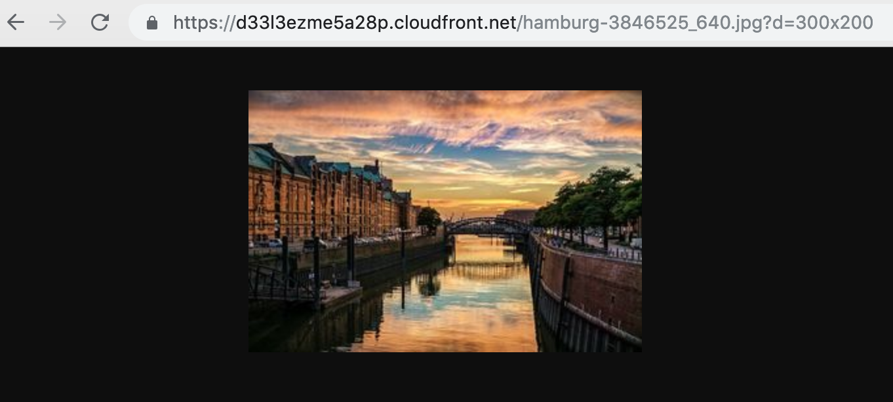

# 서버리스 온디맨드 이미지 리사이징 서비스 구축하기

### 기존의 아키텍쳐
  

클라이언트가 업로드 서버에 전송하면 업로드서버에서 썸네일 생성하여 S3서버에 각각 저장
### 문제점

클라이언트의 디스플레이 크기에 따라서 최적화된 이미지를 내려주기 위해 5장 6장의 썸네일 생성됨  
 **=> 사진을 저장하기 위한 인프라 비용이 증가**

### 해결 방안
[Lambda@Edge](https://docs.aws.amazon.com/ko_kr/AmazonCloudFront/latest/DeveloperGuide/lambda-event-structure.html)를 이용해 실시간으로 이미지 변환하는 방법으로 전환

On-demand란 클라이언트에서 요청할때 처리한다는것  

Lambda@Edge란 Cloudfront Edge 전후 위치에서 실행되는 Lambda 서비스입니다.
 

**`즉 업로드는 원본만 하고 클라이언트에서 썸네일을 요청할 때 첫 생성시 실시간으로 이미지를 리사이징하여 제공하는 방식`**

### 온디맨드 이미지 리사이징 장점
- 서비 비용 감소
- 서버를 별도로 운영하지 않아도 되고 메인서버에 부담을 주지않는다.


### 온디맨드 이미지 리사이징 단점
- 매번 요청 할때마다 이미지를 resizing하는 Cost가 적지 않다.  => CDN Caching 으로 꽤 많은 부분 해결
- 썸네일 이미지 크기가 변경되는 경우 한 번에 너무 요청이 밀려서 이미지 변환이 실패할 수 있다.

### Lambda@Edge 제한사항
1. Origin Response를 트리거로 하는 Lambda에는 Event 객체가 전달됩니다. 이 때 Body에 담긴 원본 이미지를 사용할 수 없습니다. 따라서 이미지의 사이즈를 조절하기 위해 S3로 다시 객체를 요청해야 합니다. 
2. Lambda@Edge에 헤더를 사용시 블랙리스트가 있음
3. Body를 조작한다면 그 크기는 1MB 이하여야 합니다.
4. us-east-1 리전에만 Lambda@Edge를 배포할 수 있습니다. 트리거를 생성하면 Lambda가 그 함수를 전 세계의 AWS 리전에 복제합니다  
[더보기](https://docs.aws.amazon.com/ko_kr/AmazonCloudFront/latest/DeveloperGuide/lambda-requirements-limits.html)


### 이미지 리사이즈 동작 방식
1. 썸네일 이미지 요청시 캐싱되어 있지 않다면 CloudFront는 S3로 이미지를 요청하고 S3는 해당하는 이미지로 응답합니다.
2. 이때 Origin Response에서 요청받은 이미지를 리사이징 하여 응답의 Body로 설정하여 CloudFront에 전달
3. 최종적으로 클라이언트에 썸네일을 제공


https://dasfsdafasd.cloudfront.net/image.jpg **`?d=100x100`**

Query String에 “d” 이름의 필드로 리사이징 하고자 하는 넓이와 높이 값을 전송 경로와 함께 요청하여 이미지를 얻는 것입니다.

## 1. S3 Bucket 생성
생성 후 테스트할 Image 파일을 Bucket에 업로드 한다.

## 2. CloudFront 생성
Step 1: Select delivery method => Web을 선택합니다.  
Step 2: 아래 그림과 같이 설정후 생성해줍니다.  


## 3. Node.js 패키징하기
```zsh
$ mkdir origin-response-function
$ cd origin-response-function
$ wget https://raw.githubusercontent.com/LuceteYang/TIL/master/aws/source/index.js
$ wget https://raw.githubusercontent.com/LuceteYang/TIL/master/aws/source/package.json
$ npm install;
# index.js파일에서 BUCKET_NAME을 본인이 생성한 **`BUCKET 이름`** 으로 수정해준다.
$ zip -FS -q -r ../origin-response-function.zip *
```
origin-response-function 폴더 밖에 origin-response-function.zip이 생겼다면 이제 그 zip파일을 Lamda함수 생성시 넣어주면 된다.  
> [!메모]
>
> sharp module에서 에러가 난다면 docker를 통해 받아서 해결하였다. npm run dockerbuild을 돌려보자 (잘되면 Skip!)
## 4. Lambda@Edge 구성

1. IAM Console로 접속하여 왼쪽 네비게이터에서 **Role**를 클릭한 후 **Create role**를 클릭한다.

2. **Create role**화면이 뜨면 **Select type of trusted entity**는 `AWS service`를, **Choose the service that will use this role**는 `Lambda`를 선택하고 **Next: Permissions**버튼을 클릭한다.

3. **Attach permissions policies**에서는 `AWSLambdaBasicExecutionRole`을 검색하여 체크박스에 체크한 후 **Next: Review**버튼을 클릭한다.

4. **Review**에서 다음과 같이 입력한 후 **Create role**버튼을 클릭한다.
    - `Role name`: Role 이름을 정의한다. 알아보고 구분하기 쉽게 입력한다. 권장은 LambdaEdge{NAME}으로 입력하는 것이다.
    - `Trusted entities`: 값이 `AWS service: lambda.amazonaws.com`인지 확인한다.
    - `Policies`: 값이 `AWSLambdaBasicExecutionRole`인지 확인한다.

5. 생성된 Role을 검색하여 클릭한다.

6. 생성된 Role의 **Summary**화면이 나오면, **Trust relationships**탭으로 이동한 후 **Edit trust relationship**버튼을 클릭한다.

7. **Edit Trust Relationship**화면이 뜨면, 다음과 같이 내용을 수정한 후 **Update Trust Policy**버튼을 클릭한다.
    ```trust policy
    {
        "Version": "2012-10-17",
        "Statement": [
            {
            "Effect": "Allow",
            "Principal": {
                "Service": [
                    "lambda.amazonaws.com",
                    "edgelambda.amazonaws.com"
                ]
            },
            "Action": "sts:AssumeRole"
            }
        ]
    }
    ```

8. Trust Policy의 수정이 완료되면, **Trusted entities**에 다음 그림과 같이 표시되어야 한다.


## S3 Bucket Policy 수정
9. S3 Console로 접속하여 앞서 생성한 S3 Bucket을 클릭하여 **Permissions**탭을 클릭한다.
**YOUR_ROLE_NAME**
10. 상단에 **Bucket Policy**를 클릭한 후 Policy를 다음과 같이 수정한다.
생성한 Bucket이름과 ROLE이름을 적어준다.  
OAI_ID는 Cloudfront에서 Security > Origin Access Identity에서 확인할수있다.

    ```S3 bucket policy
    {
        "Version": "2008-10-17",
        "Statement": [
            {
                "Sid": "1",
                "Effect": "Allow",
                "Principal": {
                    "AWS": [
                        "arn:aws:iam::cloudfront:user/CloudFront Origin Access Identity {OAI_ID}",
                        "arn:aws:iam::{ACCOUNTNUMBER}:role/{YOUR_ROLE_NAME}"
                    ]
                },
                "Action": "s3:GetObject",
                "Resource": "arn:aws:s3:::{YOUR_BUCKET_NAME}/*"
            },
            {
                "Sid": "2",
                "Effect": "Allow",
                "Principal": {
                    "AWS": "arn:aws:iam::cloudfront:user/CloudFront Origin Access Identity {OAI_ID}"
                },
                "Action": "s3:ListBucket",
                "Resource": "arn:aws:s3:::{YOUR_BUCKET_NAME}"
            }
        ]
    }
    ```

## Lambda function 생성과 배포
11. Lambda Console을 N.Virginia 지역으로 접속하여 **Create function**을 클릭하여 `origin-response-function`을 생성한다.

12. **Create function**화면이 뜨면 다음과 같이 입력한 후 **Create function**버튼을 클릭한다.
    - `Runtime`: **Node.js 8.10**을 선택한다.
    - `Role`: **Choose an existing role**을 선택한다.
    - `Existing role`: 앞서 생성한 Role을 선택한다.

13. 생성된 Lambda function의 **Function code**영역에서 **Code entry type**을 `Upload a .ZIP file`로 변경한다.

14. 변경 후 **Function package**에 있는 **Upload**버튼을 클릭하여 다운로드 받은 `origin-response-function.zip`파일을 선택한다.

15. 작업이 완료되었으면 상단에 **Save**버튼을 클릭하여 Lmabda function을 저장한다.

16. **Basic settings**영역에 Memory영역을 `512`로, **Timeout**값을 `10`으로 변경하자.

17. 상단에 **Actions**버튼을 클릭한 후 **Publish new version**을 클릭한 후 **Publish new version from $LATEST**화면이 뜨면 **Version description**에 `1`을 입력한 후 **Publish**버튼을 클릭한다.

18. 상단에 있는 배포된 `origin-response-function`의 ARN을 복사하여 메모해 둔다.

## CloudFront에 Lambda function 연결
19. CloudFront Console로 접속하여 앞서 생성한 Distribution을 클릭한다.

20. **Behaviors**탭으로 이동하여 **Default**정책을 선택한 후 **Edit**버튼을 클릭한다.

21. 제일 아래쪽에 **Lambda Function Associations**옵션에 다음과 같이 입력한 후 **Yes, Edit**버튼을 클릭한다.
    - `Event Type`: Origin Response
    - `Lambda Function ARN`: 배포된 `origin-response-function`의 ARN

22. CloudFront의 Domain Name을 복사하여 다음과 같은 URL을 만든 후 주소창에 입력한다. 그리고 원하는 이미지가 출력되는지 확인 한다.
    ```
    https://{CLOUDFRONT_DOMAIN_NAME}/sample.jpg
    ```

23. 다음과 같이 `d`라는 Query String을 추가하여 조회해 본다.
    ```
    https://{CLOUDFRONT_DOMAIN_NAME}/sample.jpg?d=100x100
    ```




## 로그를 확인하거나 에러를 확인
**CloudWatch** 에서 확인해보자


