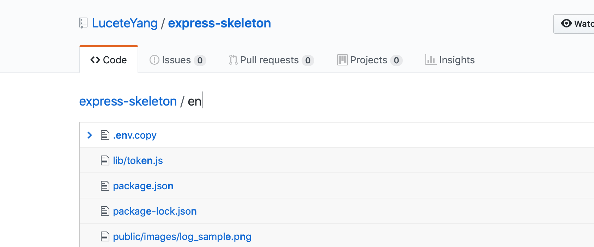

# github 유용한 툴

### [Octotree](https://chrome.google.com/webstore/detail/octotree/bkhaagjahfmjljalopjnoealnfndnagc?hl=ko)
Github 리포지토리의 폴더구조를 텍스트에디터처럼 왼쪽에 트리형태로 보여주는 크롬 익스텐션입니다.

접었다 폈다 할수도 있으며 클릭하여 해당 폴더나 파일로 이동할 수도 있습니다!

### [Git History Browser Extension](https://chrome.google.com/webstore/detail/git-history-browser-exten/laghnmifffncfonaoffcndocllegejnf/related?hl=ko)
협업하는 프로젝트일 경우 한 파일에서 협업자들끼리 어떻게 소스를 수정하였는지 볼수있는 툴입니다.

	

### 단축키 T
레포지토리에서 t 를 누르면 파일을 검색할수있습니다.

